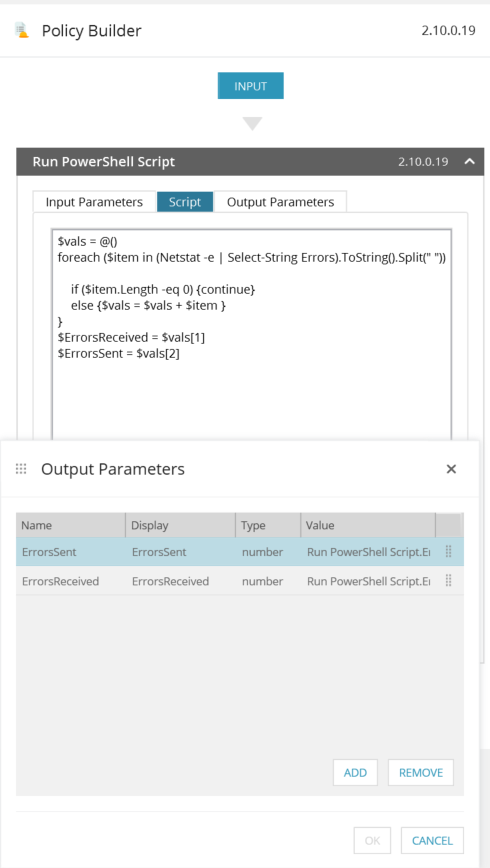
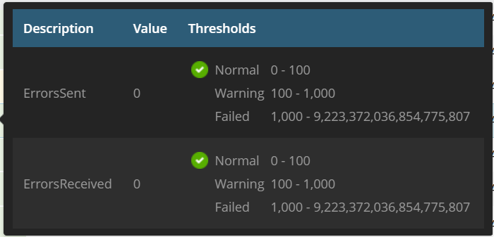

## Check Network errors.


Very simple powershell script that parses netstat -e and records to output parameters ErrorsSent and ErrorsReceived.

```powershell
$vals = @()
foreach ($item in (Netstat -e | Select-String Errors).ToString().Split(" ")) {
    
    if ($item.Length -eq 0) {continue}
    else {$vals = $vals + $item }
}
$ErrorsReceived = $vals[1]
$ErrorsSent = $vals[2]
```


todo :

* Need to parse Discards as well.

### AMP


### Ncentral Service template

