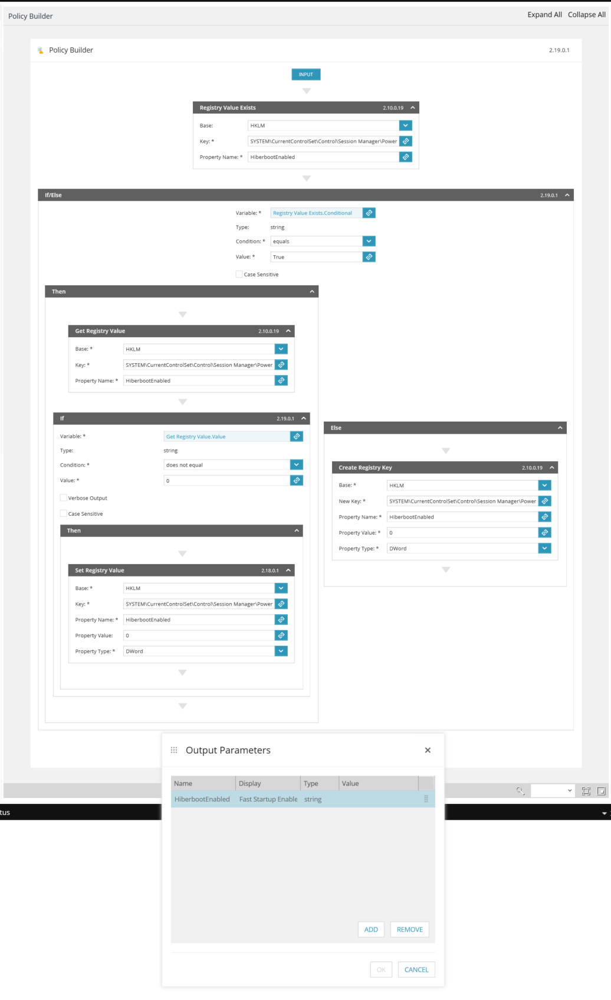
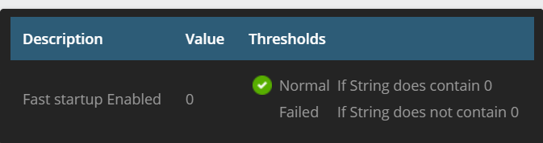

# Check and disabled fast startup.

Not a very pretty implementation, especially since I'm storing the output as a string. But Since i want the value to be zero, in the service template in N-central I check if the registry is not "0" to initiate the self-healing.

### Fast Startup Enabled
Checks if fast startup is enabled

### Disable Fast startup
Used as a self healing task if Fast startup enabled triggers.

### Ncentral Service template

