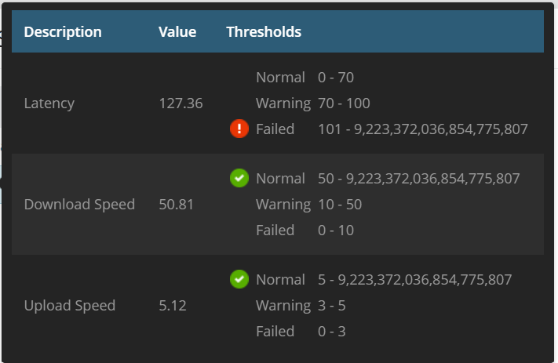
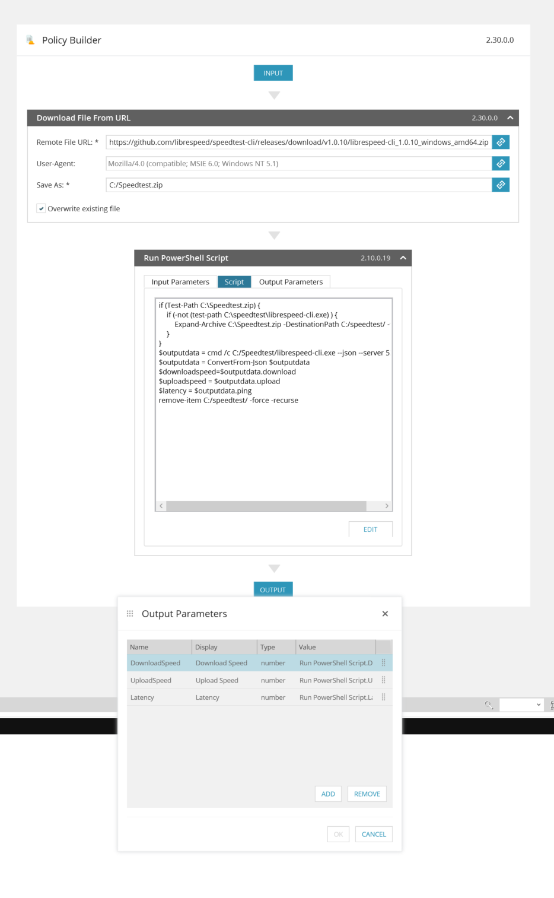

## Speed Test via Librespeed-cli

downloads librespeed-cli_1.0.10.zip, Expands the archive, runs powershell script, gathers results to DownloadSpeed, Uploadspeed, and Latency.

Todo:
* Add jitter to parsing.

### N-central Service template

### AMP

